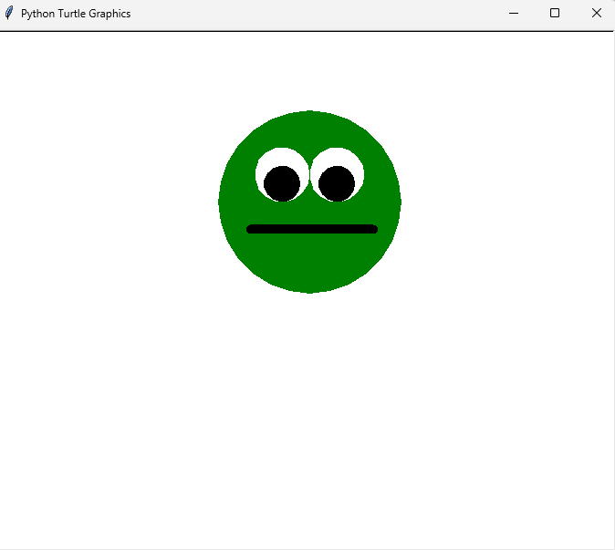

# Python-Cartoon-Face-Drawing-Using-Python-Turtle-Graphics
# 🐢 Python Turtle Project: Cartoon Face

This project uses the `turtle` module in Python to draw a cartoon-style face with two expressive eyes and a simple mouth. The project was designed as part of a graphics programming assignment to develop precision and creative control with turtle movements.

## Demo


## 🧠 Features
- Green filled circle face
- Two white and black layered eyes
- Thick straight mouth using pen size
- Commented nose section for future experimentation

## 🔧 Requirements
- Python 3.x
- turtle (standard library)

## 💻 How to Run
```bash
python face_drawing.py
